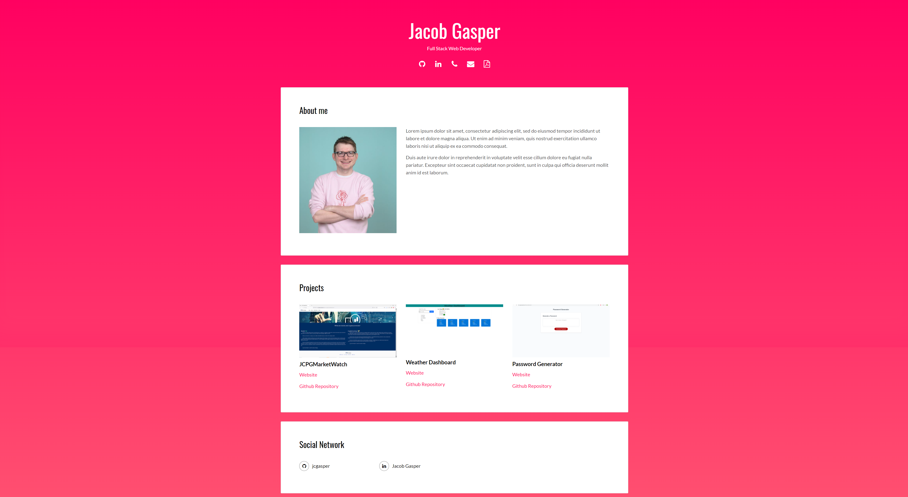

# 02-Advanced-CSS-Portfolio

Advanced CSS Portfolio

Description:
 - Portfolio website with sections to introduce myself, display my coding projects, and a section to find mcontact information.
 
 

Skills Learned:
- How to begin working on a project from scratch
- Assemble basic portfolio webpage with simple features
- Adjust styling to improve webpage

Created using: 
  - HTML
  - CSS
  - Github/Github pages
  - Portfolio Template

 [Github Pages Website](https://jcgasper.github.io/02-Advanced-CSS-Portfolio/index.html "Github Pages Website")
  

Credits:
 - Jacob Gasper

